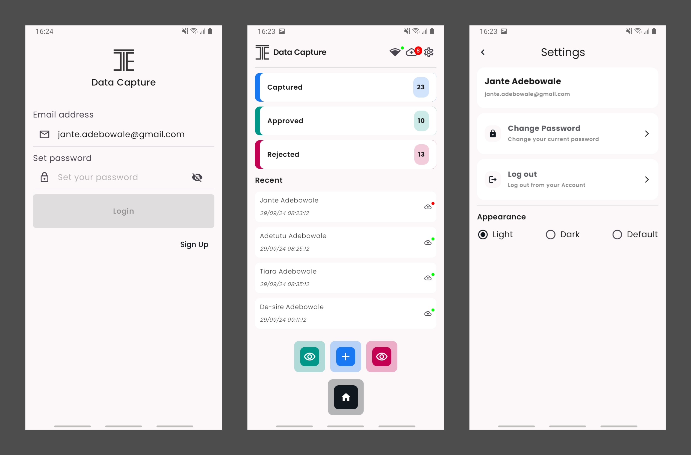
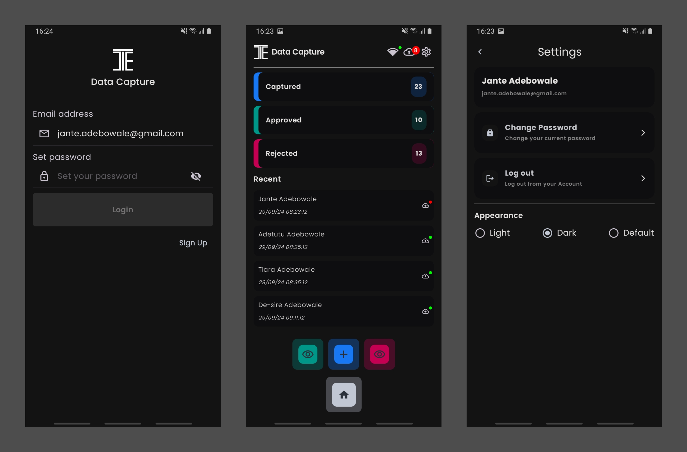

# Data Capture App
## Introduction
Data Capture App is a modern Android application built entirely with Kotlin and Jetpack Compose. It follows Android design and development best practices and demonstrates the use of modern tools and libraries to create a functional, reactive user experience.
### Screenshots (Light theme)

### Screenshots (Dark theme)

## Features
- **Jetpack Compose:** An entirely declarative UI toolkit for intuitive user interface design.
- **Room Database:** Constructs Database by providing an abstraction layer over SQLite to allow fluent database access.
- **Retrofit:** Constructs the REST APIs.
- **Coroutines & Flow:** For asynchronous and reactive programming, making the code more readable and easier to understand.
- **WorkManager:** Handles background task in a guarantee way.
- **Type Safe Compose Navigation:** Simple and a safe way to handle navigation within the Compose ecosystem.
- **ViewModel:** Manages UI-related data holder and lifecycle aware. Allows data to survive configuration changes such as screen rotations.
- **Koin:** Dependency injection with minimal boilerplate and maximum scalability.
- **Encrypted Shared Preferences:** A modern way to store user sensitive data asynchronously.
- **Dark and Light Theme Support:** User-friendly theme support that utilizes system settings.
- **Clean Architecture:** A maintainable,sustainable and testable architecture that handles separation concerns.
## Architecture
**Data Capture App** is based on the MVVM architecture and the Repository pattern, which follows the [Google's official architecture guidance](https://developer.android.com/topic/architecture).
## Backend Service
**Data Capture App** has a SpringBoot backend service,written in Java and uses in-memory database ([H2](https://www.h2database.com/)) which makes it easy to run as a self-contain service. It's available [here](https://github.com/jante-adebowale/data-capture-service)
The backend service provides the following endpoints:
* Sign Up
* Login
* Refresh Token
* Data Upload
* Data Query
* Data Analytics
* Password Reset
* Logout
* Api Documentation

**Connect with me on:**
* [Portfolio](https://www.janteadebowale.com)
* [Youtube](https://www.youtube.com/@jante-adebowale)
* [LinkedIn](https://www.linkedin.com/in/jante-adebowale)
* [Github](https://github.com/jante-adebowale)

  
   
  

